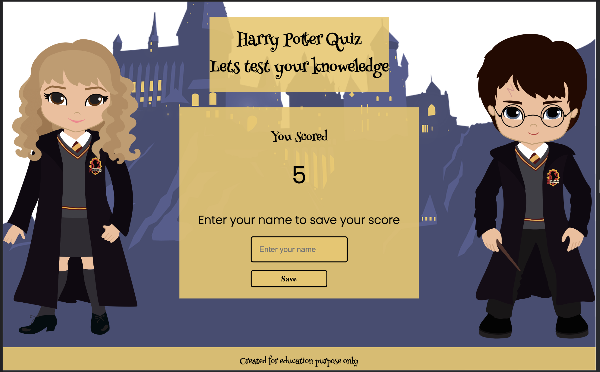
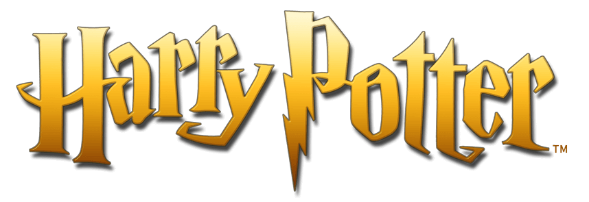

# Harry Potter Quiz Game
A Quiz game to test knowledge on Harry Potter books and movies.
---

# Contents
* [USER STORIES](#USER)
* [FEATURES](#features)
* [Flowchart](#flow)
* [WIREFRAMES](#wireframes)
* [HOME](#home-page-1)
* [TECHNOLOGIES and LANUAGES USED](#Technologies)
* [DESIGN](#Design)
* [TESTING](#Testing)
* [BUGS](#Bugs)
* [DEPLOYMENT](#Deployment)
* [LIVE LINK FOR SITE](#LIVELINK)
* [CREDITS](#Credits)

---
# User stories
This game is to be played for fun to test the players knowledge of Harry Potter. As Harry Potter's is loved and appreciated by people of various ages and backgrounds is game need to be enteraining and engaging to a wide variety of people.

## As a player 
* To test the player knoweledge.
* Understand how to play.
* Is easy to navigate.
* Let the player know if they got the answer correct.
* Let player beat their highest score.
* Save player score on a leader board.

# Features

# Flow Chart

---
# Wireframes

## [Home page](documentation/wire-frame-harry-potter/home-wire.png)
## [How to play](documentation/wire-frame-harry-potter/rules-wire.png)
## [Game page](documentation/wire-frame-harry-potter/game-wire.png)
## [Result page](documentation/wire-frame-harry-potter/results-wire.png)
---

# Home Page
* Home page has play game button when press open game page and starts game.
---
 

## How to Play
* Opens when how to play is pressed
* Contains instruction for game.

# Game Page
## On this page there is a heads up display which displays :
* Question counter 
* Timer 
* Score 
## The game container displays ;
* Random question
* Four multiple choice questions
* go home button 
* Next button

# Results 
* Displays score 
* Input to enter name 
* Save buttonto save score 
* Alert message if name not entered  

---
# High Score
* Displays most recent score in a lists 
* Play agin button
* Go to home button
* Reset scores button

# Technologies & Lanuages
  - [HTML](https://developer.mozilla.org/en-US/docs/Web/HTML) 
   - [CSS](https://developer.mozilla.org/en-US/docs/Web/css)
   - [CSS Flexbox](https://developer.mozilla.org/en-US/docs/Learn/CSS/CSS_layout/Flexbox) 
   - [CSS Grid](https://developer.mozilla.org/en-US/docs/Web/CSS/grid)
   - [Balsamiq](https://balsamiq.com/)
   - [GitHub](https://github.com/) 
   - [VS Code](https://code.visualstudio.com/)
   - [Tinyjpg](https://tinyjpg.com/)
   - [Miro](https://miro.com/)
   - [Favicon](https://favicon.io/)

# Design
## logo
* Is image from [pngwing](https://www.pngwing.com/)

---
## Favicon
* Created on [Favicon](https://favicon.io/)

---

## Fonts

### Henny Penny was used for headings 

### Poppins was used to Question

---
## Color Palette 
* Color Palette was chosen from the color on the background image.
---

 

# Testing

* I have tested the site  on Chrome, Safari and Firefox
* I have tested the site on different screen sizes to confirm it is responsive.
* I have tested all links to confirm they are functioning.

----

# Manual Testing
| Feature | Expect | Action | Result |Tested |
|---|---|---|---|---|
|Play button |go to game page and start game|Press play button|Start game|Pass|
|How to play button |Display instructions for game|Press play button|Display instructions|Pass|
|Close Modal Button |Close insturctions|Click button or anywhere out side modal|Close Modal|Pass|
|Timer  |Starts onload|Press play button|Start timer |Pass|
| play button |go to game page and start game|Press play button|Start game|Pass|
|Question Counter|display how mant question answered|Selectan answer|question counter increasese|Pass|
|Score |Increments with every correct answer|Click on the correct answer|Score increments by 1|Pass|
|Color green to indicate answer is corrcet |Color green fills background of correct answer|Pick the correct answer|Green color indicates correct answer|Pass|
|Color red to indicate answer is incorrcet |Color red fills background of incorrect answer|Pick the incorrect answer|Red color indicates incorrect answer|Pass|
|Display ramdon Question from list |Different question no repeats|Press Play or Choose an answer|Ramdom question displayed|Pass|
|Result |Show results score |Play game|Start game|Pass|
|Save Score|Save score and display it in highscores|Enter name and press save|Save score|Pass|
|Alert message|Display alert to enter name to save score if input is empty|Press save when enter name input is empty|Display Alert|Pass|
|High scores list||Save the top five score and display them inorder of highest score first|Save name|Pass|
|Play again button |go to game page and start game again|Press play again button|Start game|Pass|
|Go home button |go to Home page |Press go home button|back to home page|Pass|
|Reset scores button|Clears high scores|Press reset score button|Reset high score list|Pass|

---
## Validator Testing
### [W3C](https://validator.w3.org/) was used for validation of Html
* [Home page](documentation/testing-images/htmlcheck-home.png)
* [Game Page](documentation/testing-images/Htmlcheck.game.png)

 ### [Jigsaw](https://jigsaw.w3.org/css-validator/) was used for validation of CSS
 * [Home page](documentation/testing-images/css-validator-home.png)
 * [Game Page](documentation/testing-images/css-validator-game.png)

 ### [Jshint](https://jshint.com/) was used for validation of Javascript
 * [Home page](documentation/testing-images/jshint-home.png)
 * [Game Page](documentation/testing-images/jshint-game.png)

 ---
 ## Lighthouse Testing
### DESKTOP
* [Home page](documentation/testing-images/lighthouse-home-d.png)
* [Game page](documentation/testing-images/lighthouse-game-d.png)

### MOBILE
* [Home page](documentation/testing-images/lighthouse-home-m.png)
* [Game page](documentation/testing-images/lighthouse-game-m.png)

# Bugs 
## High Scores would not updating 
### Description
High score would not update when high score container displayed.
### Fixed 
The issue was resolved by
* Joining both the game.html and end.html together
* Joining both the game.js and end.js together 
* Changing the variable for mostRecentScores to let instead of const.

### Warning 
* This warning is showing on google chrome site 
* It does not effect the game.

---
## Mistakes
* During the project I made a some commit message mistakes

# Deployment
* GitHub pages were used to deploy the site.
* This was done by: 
  1. Sign in to the GitHub account
  2. Go to [GitHub repository](https://edelcorbett.github.io/harry-potter-pp2/),
  3. Go to the **Settings** 
  4. Click **Pages** on the navigation on the left-hand side.
  5. In the source section select the **Main** Branch
  6. Select the root folder
  6. Then click "Save".
* The site is deployed and is accessible by the URL at the top of the page

# Live Link [Harry Potter Quiz](https://edelcorbett.github.io/harry-potter-pp2/)

# Future Features
I would  incorporate different difficulty levels to the game.

---

# Credits 
* [James Q Quick](https://www.youtube.com/watch?v=rFWbAj40JrQ&list=PLB6wlEeCDJ5Yyh6P2N6Q_9JijB6v4UejF)I use this youtube video for gudiance build game.
* [Web Dev Simplified](https://www.youtube.com/watch?v=riDzcEQbX6k ) I also use this youtude video.
* [Coolors](https://coolors.co/) was used to create the color palette.
* [Slack Community](https://app.slack.com/) I use slack channels for guidance
* [CSS TRICKS](https://css-tricks.com/)
* [Stack overflow](https://stackoverflow.com/) for information.
* [W3Schools](https://www.w3schools.com/) was used as reference
* [Techsini](http://techsini.com/) was used for resposive mock-up.      

* [pngwing](https://www.pngwing.com/) was used for background images.
* [Google](https://www.google.com/) was used troughout project for reference.
* [Chatgpt](https://chat.openai.com/) was use for quiz questions and reference.
## Images
* Background images was used from [pngwing](https://www.pngwing.com/) .

## Acknowledgements
I would like to acknowledge 
* [Code Institute](https://codeinstitute.net/)
* Juliia Konn My Mentor for her advice and support thought out the project. 
* Madison Corbett for help creating questions and testing.
