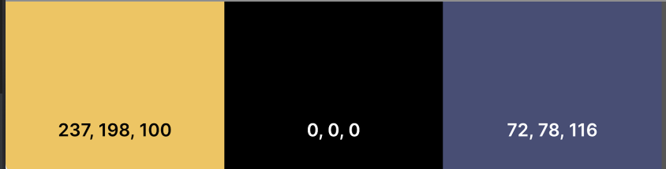

# Harry Potter Quiz Game
A Quiz game to test knowledge on Harry potter books and movies.
# Contents
* [USER STORIES](#USER)
* [FEATURES](#features)
* [WIREFRAMES](#wireframes)
* [Home](#home-page-1)
* [TECHNOLOGIES and LANUAGES USED](#Technologies)
* [DESIGN](#Design)
* [TESTING](#Testing)
* [BUGS](#Bugs)
* [DEPLOYMENT](#Deployment)
* [LIVE LINK FOR SITE](#LIVELINK)
* [CREDITS](#Credits)

---
# User stories
This game is to be played for fun to test the players knowledge of Harry Potter. As Harry Potter's is loved and appreciated by people of various ages and backgrounds is game need to be enteraining and engaging to a wide variety of people.

## As a player 
* To test the player knoweledge.
* Understand how to play.
* Is easy to navigate.
* Let the player know if they got the answer correct.
* Let player beat their highest score.
* Save player score on a leader board.

# Features

# Wireframes

## [Home page](documentation/home%20page.png)
## [How to play](documentation/how%20to%20play.png)
## [Game page](documentation/game%20page%20.png)
## [Result page](documentation/result%20page.png)

# Home Page

# How to Play

# Game Page

# Results 

# Technologies & Lanuages
  - [HTML](https://developer.mozilla.org/en-US/docs/Web/HTML) 
   - [CSS](https://developer.mozilla.org/en-US/docs/Web/css)
   - [CSS Flexbox](https://developer.mozilla.org/en-US/docs/Learn/CSS/CSS_layout/Flexbox) 
   - [CSS Grid](https://developer.mozilla.org/en-US/docs/Web/CSS/grid)
   - [Balsamiq](https://balsamiq.com/)
   - [GitHub](https://github.com/) 
   - [VS Code](https://code.visualstudio.com/)

# Design

## Fonts

### Henny Penny was used for headings 

### Poppins was used to Questions

## Color Palette

 

# Testing

# Manual Testing
| Feature | Expect | Action | Result |Tested |
|---|---|---|---|---|
| Header ||||

# Bugs
## High Scores would not updating 
### Description
High sore would not update when high score container displayed.
### Fixed 
the issue was resolved by
* joining both the game.html and end.html together
* joining both the game.js and end.js together 
* Changing the variable for mostRecentScores to let instead of const.

# Deployment
* GitHub pages were used to deploy the site.
* This was done by: 
  1. Sign in to the GitHub account
  2. Go to [GitHub repository](https://edelcorbett.github.io/harry-potter-pp2/),
  3. Go to the **Settings** 
  4. Click **Pages** on the navigation on the left-hand side.
  5. In the source section select the **Main** Branch
  6. Select the root folder
  6. Then click "Save".
* The site is deployed and is accessible by the URL at the top of the page

# Live Link [Harry Potter Quiz](https://edelcorbett.github.io/harry-potter-pp2/)

# Credits 
